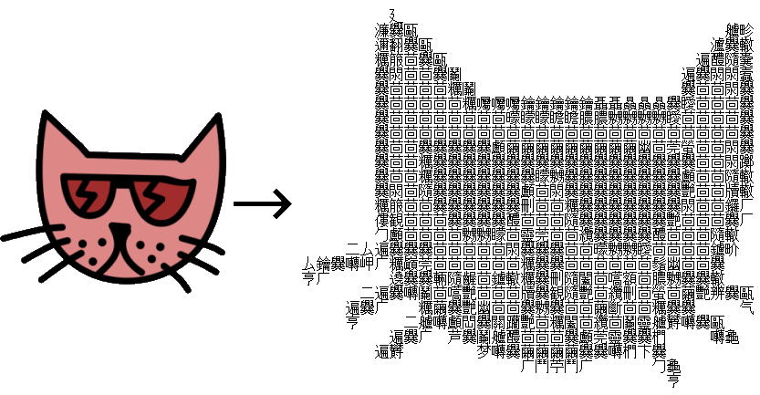
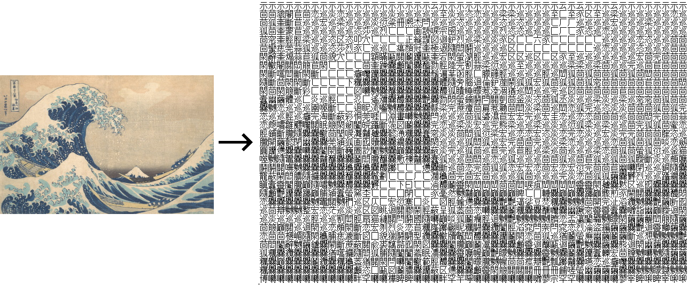

# hanzcii

Script to convert images to Chinese-character (漢字/hanzi/kanji) art


## Samples

`python hanzcii.py examples/cat.png -o cat.txt`



`python hanzcii.py examples/kanagawa.jpg -c 1.6 -s 1.3 -b 0.9 -o kanagawa.txt`




## Usage

```
usage: hanzcii.py [-h] [-o OUTPUT] [-c CONTRAST] [-s SHARPNESS]
                  [-b BRIGHTNESS]
                  IMG

positional arguments:
  IMG                   input image filename

optional arguments:
  -h, --help            show this help message and exit
  -o OUTPUT, --output OUTPUT
                        output text filename; default is input image filename
                        + .txt)
  -c CONTRAST, --contrast CONTRAST
                        adjust input contrast with PIL.ImageEnhance.Contrast;
                        default 1.0
  -s SHARPNESS, --sharpness SHARPNESS
                        sharpen/blur input with PIL.ImageEnhance.Sharpness;
                        default 1.0
  -b BRIGHTNESS, --brightness BRIGHTNESS
                        brighten input with PIL.ImageEnhance.Brightness;
                        default 1.0
```


## Potential improvements

* currently only uses chars in main CJK Ideograph block (U+4E00–9FFF), could/should be expanded
* [JFドット東雲ゴシック/JF Dot Shinonome Gothic](http://jikasei.me/font/jf-dotfont/) included as default reference font, but should be tweaked to more easily use whatever


## Shoutouts

* [@kernalphage](https://github.com/kernalphage)
